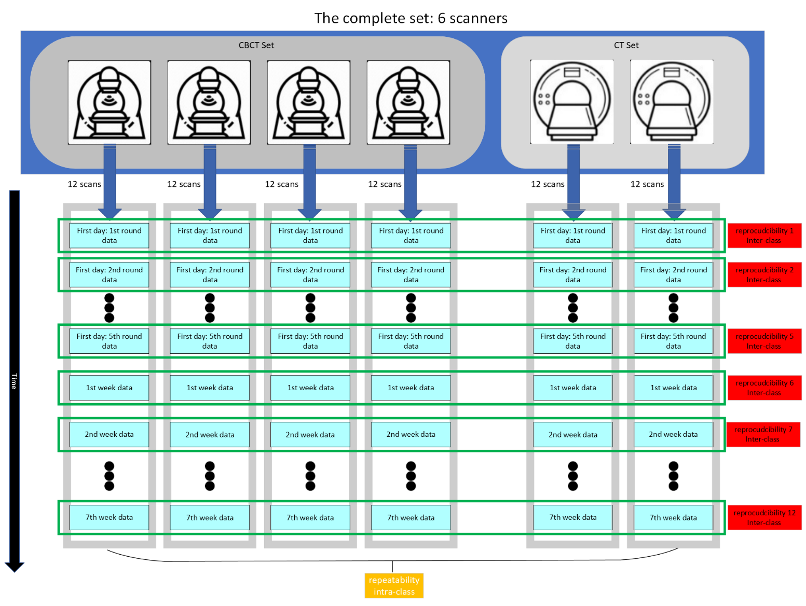

# ICC Calculation Scripts and Plotting Functions

Welcome to the official repository for Radiomic Features of planning CT and cone-beam CT: A cross-sectional and Longitudinal Analysis of Robustness and Consistency.
This repository contains all the necessary scripts and templates to perform ICC calculations and generate plots for radiomic features.

## Data Folder
The `Pyradiomics_Params_CT.yaml` file is used for extracting RFs from the original images.
The `data` folder contains all the files with radiomic feature values. Here is a detailed breakdown of the file structure and contents:

1. **File Naming Convention**:
    - The first number in the file name represents different machines.
    - Numbers 1-4 indicate CBCT machines.
    - Numbers 5-6 indicate CT machines.

2. **File Structure**:
    - Each file contains 180 rows, representing 12 repeated scans of 15 phantoms (12 × 15 = 180).
    - The 12 repeated scans are divided as follows:
        - The first 5 scans are repeated within one day.
        - The remaining 7 scans are conducted approximately one week apart.
    - The exact time of each scan can be determined from the suffix in the `patient` column.

3. **Column Naming**:
    - Each column name represents a radiomic feature.
    - The names are primarily composed of three parts:
        - **Filters**: Examples include `original`, `wavelet-HHH`, etc. Detailed information can be found in the `filters.txt` file.
        - **RF Groups**: Examples include `firstorder`, `glcm`, etc. Detailed information can be found in the `features.txt` file under the `key` section.
        - **RFs**: Examples include `10Percentile`, `90Percentile`, etc. Detailed information can be found in the `features.txt` file under the `value` section.
        - Note: Shape-related features exist only within the `original` filter. Since this experiment uses phantoms as scanning objects, ICC values for these features are not calculated.

## Usage

To use these scripts and templates, follow these steps:

1. Clone the repository:
    \`\`\`bash
    git clone https://github.com/MaastrichtU-CDS/radiomics-ct-cbct-tianjin-3Dphantom.git
    \`\`\`

2. Navigate to the repository directory:
    \`\`\`bash
    cd radiomics-ct-cbct-tianjin-3Dphantom
    \`\`\`

3. Run ICC_analysis.py for ICC calculation. For more details on ICC analysis, see the [ICC Analysis Script](#icc-analysis-script) section below.

## ICC Analysis Script

This script performs ICC calculations based on the provided parameters and data. The script name is `ICC_analysis.py`.

### Command-Line Arguments

- `--input_path`: Path to the input TXT file containing paths to CSV files.
  - **Type**: `str`
  - **Required**: `True`
  - **Example**: `--input_path /path/to/input.txt`
  - **Description**: This argument specifies the path to a TXT file that contains the paths to the CSV files to be processed.

- `--rows_number`: An integer range separated by commas.
  - **Type**: `str`
  - **Required**: `True`
  - **Example**: `--rows_number 0,15`
  - **Description**: This argument specifies the range of rows to be processed, separated by commas. For example, `0,15`.

- `--col_name`: Column name to filter.
  - **Type**: `str`
  - **Required**: `True`
  - **Example**: `--col_name FeatureName`
  - **Description**: This argument specifies the name of the column to be filtered in the CSV files.

- `--output_path`: Output folder path.
  - **Type**: `str`
  - **Default**: `results`
  - **Example**: `--output_path /path/to/output`
  - **Description**: This argument specifies the path to the output folder where the results will be saved. If not provided, the default folder is `results`.

- `--subset_number`: Subset selection.
  - **Type**: `str`
  - **Required**: `True`
  - **Example**: `--subset_number 1`
  - **Description**: This argument specifies the subset to be processed. Use `0` for the whole set, `1` for subset1, and `2` for subset2.

### Example Command

Here is an example of how to run the script with the required arguments:

\`\`\`bash
python ICC_analysis.py --input_path /path/to/input.txt --rows_number '0,15' --col_name FeatureName --output_path /path/to/output --subset_number 1
\`\`\`

### Script Description

The `ICC_analysis.py` script reads the specified CSV files, filters the data based on the provided column name and row range, and performs ICC calculations. The results are then saved to the specified output folder.

## Contact

For any questions or issues, please contact us at [minghua.li@maastro.nl](mailto:minghua.li@maastro.nl).

Thank you for using our ICC calculation scripts and plotting functions. We hope you find them helpful!

---
